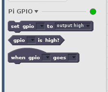
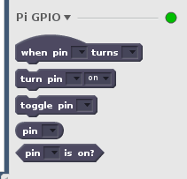
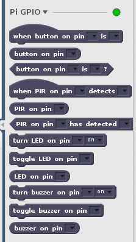

# Scratch extension prototypes

These are some prototypes I created of how the Raspberry Pi Scratch extension could be implemented.

They are to support a conversation rather than being a statement of intent.

The prototypes "work" although the code lacks finesse having been pulled together in a hurry!

## Events

`piGPIOExtension.js.events`

This adds an Event (or hat) block of `when gpio [number] goes [high/low]` to the existing extension.



## Pin based

The pin based prototype uses a **pin** description rather than a **gpio**:



## Device based

This prototypes splits blocks down in "devices" (LED, Button, Buzzer, PIR) to show how a higher level of abstraction could be implemented.



## Installation 

1. Clone this repo.

```bash
cd ~
git clone https://github.com/martinohanlon/scratch_ext_prototypes
```

2. Backup your existing scratch 2 extensions.

```bash
cp /usr/lib/scratch2/scratch_extensions/piGPIOExtension.js ~/scratch_ext_prototypes
```

3. Install "event" prototype

```bash
sudo cp ~/scratch_ext_prototypes/piGPIOExtension.js.events /usr/lib/scratch2/scratch_extensions/piGPIOExtension.js
```

4. Install "pin based" prototype

```bash
sudo cp ~/scratch_ext_prototypes/piGPIOExtension.js.pinbased /usr/lib/scratch2/scratch_extensions/piGPIOExtension.js
```

5. Install "device based" prototype

```bash
sudo cp ~/scratch_ext_prototypes/piGPIOExtension.js.devicebased /usr/lib/scratch2/scratch_extensions/piGPIOExtension.js
```

6. Restore original extensions

```bash
sudo cp ~/scratch_ext_prototypes/piGPIOExtension.js /usr/lib/scratch2/scratch_extensions
```
