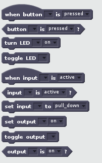

# Scratch extension prototype

This is a prototype I created of how the Raspberry Pi Scratch extension could be implemented.

It was created as a way of supporting a conversation rather than a statement of intent.



Notes:
- The code is a bit "hacky", its not meant to be production!
- the `set input [pin] to [pull_up / pull_down]` doesn't work as it would have required significant re-development of the extension.

## Installation

1. Clone this repo.

```bash
cd /home/pi
git clone https://github.com/martinohanlon/scratch_ext_prototypes
```

2. Backup your existing scratch 2 extension.

```bash
cp /usr/lib/scratch2/scratch_extensions/piGPIOExtension.js /home/pi/scratch_ext_prototypes
```

3. Install the prototype

```bash
sudo cp /home/pi/scratch_ext_prototypes/piGPIOExtension.js.prototype.js /usr/lib/scratch2/scratch_extensions/piGPIOExtension.js
```

4. Start Scratch 

5. Restore original extension

```bash
sudo cp /home/pi/scratch_ext_prototypes/piGPIOExtension.js /usr/lib/scratch2/scratch_extensions
```

## Initial prototypes

These are some early prototypes I created to support debate.

The prototypes "work" although the code lacks finesse having been pulled together in a hurry!

### Events

`piGPIOExtension.js.events.js`

This adds an Event (or hat) block of `when gpio [number] goes [high/low]` to the existing extension.


### Pin based

The pin based prototype uses a **pin** description rather than a **gpio**:


### Device based

This prototypes splits blocks down in "devices" (LED, Button, Buzzer, PIR) to show how a higher level of abstraction could be implemented.


